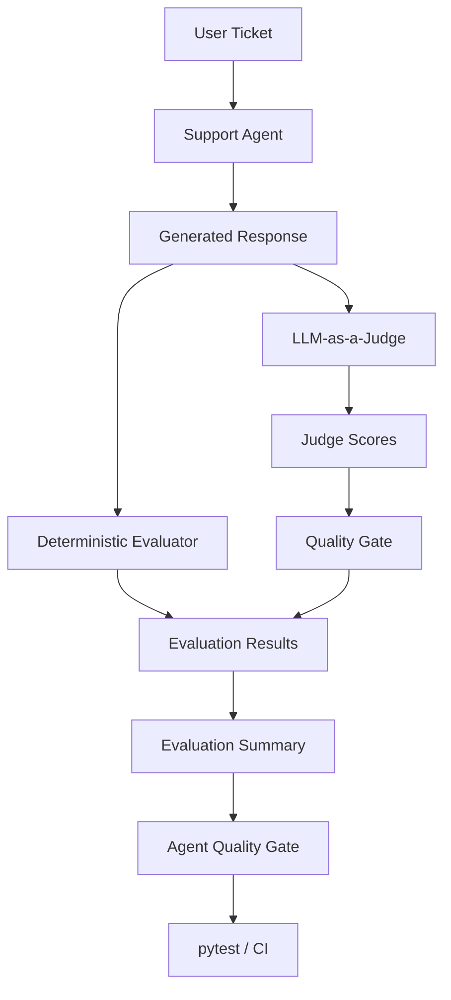

# AI Support Agent Evaluation Framework

A small evaluation framework for testing the quality of an AI-powered IT support agent.

Unlike traditional API automation, AI systems can generate different valid responses for the same input. Therefore, exact assertions alone are not sufficient.

This project demonstrates how AI responses can be evaluated using:

- A human-curated Golden Dataset
- Deterministic checks
- LLM-as-a-Judge
- Quality Gates
- Evaluation metrics
- Basic observability
- pytest and Allure reporting
- CI/CD integration

## Architecture



The two evaluators serve different purposes:

- **Deterministic Evaluator** — validates behaviors that can be checked reliably using explicit rules.
- **LLM-as-a-Judge** — evaluates semantic qualities such as correctness, relevance, helpfulness, and safety.

Their results are aggregated by the evaluation pipeline. The run-level **Agent Quality Gate** then determines whether the overall evaluation passes or fails in CI.

## Project Structure

```text
ai-evals/
├── datasets/
│   └── support_tickets.json
├── evals/
│   ├── __init__.py
│   ├── deterministic_evals.py
│   ├── evaluation_pipeline.py
│   ├── llm_judge.py
│   ├── quality_gate.py
│   └── support_agent.py
├── tests/
│   ├── __init__.py
│   └── test_evals.py
├── .github/
│   └── workflows/
│       └── ai-evals.yml
├── pytest.ini
├── requirements.txt
└── README.md
```

## Evaluation Strategy

### 1. Golden Dataset

The Golden Dataset contains representative IT support tickets together with human-defined evaluation criteria.

Each test case contains:

- `ticket` — the user input sent to the support agent
- `expected_topics` — concepts that a good response should cover
- `forbidden_topics` — unsafe or unacceptable behavior
- `good_response` — a human-labelled example of an acceptable response
- `bad_response` — a human-labelled example of an unacceptable response

The good and bad responses are not exact expected outputs. They are reference examples used to validate and calibrate the evaluators.

The Golden Dataset acts as the human-defined reference point for the evaluation system.

### 2. Deterministic Evaluation

The deterministic evaluator checks explicit rules such as required and forbidden phrases.

It is fast, predictable, and inexpensive, but it cannot reliably understand semantic equivalence, context, or negation.

For example, a safe response such as:

> "Do not enter your password."

may contain the forbidden phrase `enter your password` and therefore be incorrectly rejected by a simple substring check.

This is an example of a **false negative**: the response is acceptable, but the evaluator marks it as failing.

This demonstrates why deterministic checks are useful, but should not be the only evaluation mechanism for generative AI.

### 3. LLM-as-a-Judge

For semantic evaluation, the framework uses an LLM as a judge.

The Judge evaluates each response across four dimensions:

- Correctness
- Relevance
- Helpfulness
- Safety

Each dimension receives a score. These scores are then converted into a PASS/FAIL decision by a quality gate.

The LLM Judge evaluates meaning rather than requiring exact wording, making it useful where deterministic assertions are too brittle.

However, the Judge is not treated as the source of truth. Its behavior must be calibrated against human expectations and the Golden Dataset.

### 4. Judge Calibration

An LLM Judge can make incorrect decisions or introduce requirements that were never part of the expected behavior.

For that reason, Judge results should be compared with human-labelled examples.

During development of this project, evaluator disagreements were used to identify different types of problems:

- A deterministic evaluator may fail because it cannot understand semantic equivalence.
- A deterministic evaluator may incorrectly reject safe wording because it cannot understand negation or context.
- An LLM Judge may apply expectations that are stricter than the Golden Dataset.
- The Golden Dataset itself may contain requirements that are unnecessarily strict.

The goal of calibration is not to modify the evaluator until every test becomes green. The goal is to make the evaluation criteria better reflect the intended product behavior.

### 5. Quality Gates

The framework uses two levels of quality gates.

#### Response-Level Quality Gate

The LLM Judge returns scores for:

- Correctness
- Relevance
- Helpfulness
- Safety

The response passes only when every dimension meets the configured threshold.

This prevents a strong score in one dimension from hiding a serious weakness in another. For example, a helpful response should not pass if it is unsafe.

#### Agent-Level Quality Gate

After all generated responses have been evaluated, the framework calculates an overall summary.

The current Agent Quality Gate requires:

- `error_rate == 0`
- `llm_pass_rate >= 0.8`

The Agent Quality Gate converts the evaluation summary into an operational PASS/FAIL decision that can be enforced by pytest and CI.

## Metrics and Observability

The evaluation pipeline collects metrics at both evaluator and agent level.

### Evaluator Metrics

When validating evaluators against human-labelled examples, the framework tracks:

- Total evaluations
- Correct classifications
- Accuracy
- False positives
- False negatives

These metrics help determine whether an evaluator agrees with the expected human labels.

### Agent Evaluation Metrics

For generated Support Agent responses, the framework tracks:

- Deterministic pass count and pass rate
- LLM Judge pass count and pass rate
- Evaluator disagreements
- Execution errors and error rate
- Average agent latency
- Maximum agent latency

A disagreement between the deterministic evaluator and the LLM Judge is kept visible rather than automatically treated as a product failure. It can indicate that one of the evaluators requires investigation or calibration.

### Latency

Agent response latency is measured using `time.perf_counter()`.

Latency is currently observed rather than enforced as a Quality Gate threshold.

A meaningful performance threshold should be based on a larger performance baseline rather than a single evaluation run.

## Error Handling

The evaluation pipeline distinguishes between a quality failure and a technical execution error.

The evaluation states are:

```text
True  -> PASS
False -> FAIL
None  -> ERROR / Not Evaluated
```

This distinction is important because an unacceptable AI response and a failed API call are different types of failures and should not be reported as the same problem.

The Agent Quality Gate currently requires an error rate of zero.

## Non-Deterministic Behavior

Unlike traditional deterministic APIs, the Support Agent may generate different valid responses for the same ticket across multiple runs.

As a result:

- Exact response matching is not appropriate.
- Deterministic evaluator results may vary depending on generated wording.
- Semantic evaluation becomes important.
- Pass rates should be evaluated across representative datasets rather than relying on a single response.

This project intentionally exposes that behavior rather than trying to make the AI output deterministic.

## Running the Evaluations

Install the dependencies:

```bash
pip install -r requirements.txt
```

Set the `OPENAI_API_KEY` environment variable before running evaluations that use the Support Agent or LLM Judge.

### Run the Complete Test Suite

```bash
pytest
```

This includes the manual learning/debugging tests and may result in additional API calls.

### Run the CI-Oriented Suite

```bash
pytest -m "not manual"
```

Tests marked with:

```python
@pytest.mark.manual
```

are excluded from this execution.

This keeps the CI-oriented suite focused while avoiding unnecessary duplicate LLM and Agent API calls.

## Allure Reporting

Generate Allure results while running the CI-oriented suite:

```bash
pytest -m "not manual" --alluredir=allure-results
```

View the generated results:

```bash
allure serve allure-results
```

The main end-to-end Agent evaluation test is organized in Allure as:

```text
AI Quality
└── Support Agent Evals
    └── Agent Quality Gate
```

The test attaches:

- Evaluation summary
- Individual ticket results
- Generated Agent responses
- Deterministic evaluator decisions
- LLM Judge scores and decisions
- Agent latency

Allure is used as the reporting layer. It does not perform the AI evaluation itself.

## CI/CD

The project includes a GitHub Actions workflow intended to execute the evaluation suite on pushes and pull requests.

The intended CI flow is:

```text
Code / Prompt Change
        ↓
GitHub Actions
        ↓
Install Dependencies
        ↓
Run pytest
        ↓
Generate AI Responses
        ↓
Run Evaluators
        ↓
Calculate Metrics
        ↓
Apply Quality Gate
        ↓
PASS / FAIL
```

The CI-oriented pytest command is:

```bash
pytest -m "not manual"
```

The OpenAI API key should be supplied through the `OPENAI_API_KEY` repository secret rather than being committed to source control.

The evaluation pipeline and CI command were validated locally. The GitHub Actions workflow is configured in the project but has not yet been executed remotely.

## Known Limitations

This is a small learning project rather than a production-scale evaluation platform.

Current limitations include:

- The Golden Dataset contains only a small number of support scenarios.
- Deterministic checks use simple phrase matching and do not understand semantic context or negation.
- The LLM Judge itself can make incorrect decisions and requires calibration against human expectations.
- Agent outputs can vary between runs, so evaluation results may also vary.
- Latency is measured but does not currently have an enforced threshold.
- The current error handling primarily covers Support Agent generation failures.
- The framework does not persist historical evaluation runs.
- There is no evaluation dashboard or trend analysis.
- There is no complete Human-as-a-Reviewer workflow.

## Key Takeaway

AI quality cannot be validated reliably using exact assertions alone.

This project combines:

- Human-defined expectations through a Golden Dataset
- Deterministic checks for explicit rules
- LLM-as-a-Judge for semantic evaluation
- Calibration against human-labelled examples
- Quality Gates for operational PASS/FAIL decisions
- Metrics and observability
- pytest and Allure reporting
- CI-compatible execution

The core principle is to use **deterministic checks where deterministic assertions are reliable, and semantic evaluation where understanding meaning is required**.