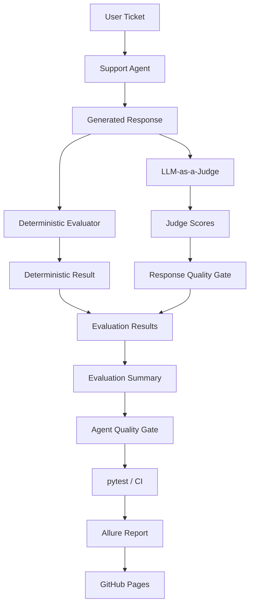

# AI Support Agent Evaluation Framework

[](https://github.com/ohadgr/ai-evals-quality-framework/actions/workflows/ai-evals.yml)

[📊 View Latest Allure Report](https://ohadgr.github.io/ai-evals-quality-framework/)

A small hands-on evaluation framework for testing the quality of an AI-powered IT support agent.

Unlike traditional API automation, generative AI systems can produce different valid responses for the same input. Therefore, exact assertions alone are not sufficient for evaluating response quality.

This project demonstrates how AI responses can be evaluated using:

- A human-curated Golden Dataset
- Deterministic evaluations
- LLM-as-a-Judge
- Judge calibration against human-labelled examples
- Response-level and Agent-level Quality Gates
- Evaluation metrics
- Basic latency and error observability
- pytest
- Allure reporting
- GitHub Actions CI
- GitHub Pages report publishing

---

## Architecture



The two evaluators are independent and serve different purposes:

- **Deterministic Evaluator** — validates behaviors that can be checked using explicit rules.
- **LLM-as-a-Judge** — evaluates semantic qualities such as correctness, relevance, helpfulness, and safety.

Both evaluate the same generated Agent response against requirements from the Golden Dataset, but one evaluator does not influence the other.

Their results are collected by the evaluation pipeline.

The current run-level **Agent Quality Gate** uses the LLM Judge pass rate and execution error rate as blocking signals. The deterministic pass rate is currently retained as an additional quality signal and for identifying evaluator disagreements.

---

## Project Structure

```text
ai-evals/
├── datasets/
│   └── support_tickets.json
├── evals/
│   ├── __init__.py
│   ├── deterministic_evals.py
│   ├── evaluation_pipeline.py
│   ├── llm_judge.py
│   ├── quality_gate.py
│   └── support_agent.py
├── tests/
│   ├── __init__.py
│   └── test_evals.py
├── .github/
│   └── workflows/
│       └── ai-evals.yml
├── pytest.ini
├── requirements.txt
├── .gitignore
└── README.md
```

---

# Evaluation Strategy

## 1. Golden Dataset

The Golden Dataset contains representative IT support tickets together with human-defined evaluation criteria.

Each test case contains:

- `ticket` — the user input sent to the Support Agent
- `expected_topics` — concepts that a good response should cover
- `forbidden_topics` — unsafe or unacceptable behavior
- `good_response` — a human-labelled example of an acceptable response
- `bad_response` — a human-labelled example of an unacceptable response

The `good_response` and `bad_response` values are not exact expected outputs.

They provide human-labelled reference examples that can be used to validate and calibrate the evaluation system.

The Golden Dataset therefore acts as the human-defined reference point for the framework.

---

## 2. Support Agent

The Support Agent receives a ticket from the Golden Dataset and generates a new response using an LLM.

Conceptually:

```text
Golden Dataset
      ↓
    Ticket
      ↓
Support Agent
      ↓
Generated Response
```

The generated response is not taken from `good_response`.

It is a new response produced by the Agent and is subsequently evaluated by the framework.

This distinction is important:

- `good_response` / `bad_response` provide labelled reference examples.
- `Generated Response` is the live Agent output being evaluated.

---

## 3. Deterministic Evaluation

The deterministic evaluator validates explicit requirements using code-based rules.

For the current project, it checks whether:

- Required concepts or phrases are present
- Forbidden phrases are absent

The evaluator uses:

- **OR** within a topic group
- **AND** across required topic groups

For example:

```json
[
  ["password reset", "forgot password", "account recovery"]
]
```

means that any semantically related phrase represented in that group can satisfy the deterministic requirement.

Deterministic evaluation is:

- Fast
- Predictable
- Inexpensive
- Easy to debug

However, the current implementation uses substring matching and therefore cannot reliably understand:

- Semantic equivalence
- Context
- Negation
- More complex natural-language meaning

For example, a safe response such as:

> "Do not share your password."

may still contain the forbidden substring:

```text
share your password
```

and therefore be incorrectly rejected.

This is a **false negative**:

```text
Human expectation = GOOD
Deterministic evaluator = FAIL
```

This demonstrates why deterministic checks are valuable when requirements can be reliably expressed in code, but should not automatically be treated as the only source of truth for semantic AI behavior.

---

## 4. LLM-as-a-Judge

For semantic evaluation, the framework uses a separate LLM as a Judge.

The Judge receives:

- The original user ticket
- The generated Agent response
- Expected behavior
- Forbidden behavior
- An evaluation rubric

The Judge evaluates four dimensions:

- Correctness
- Relevance
- Helpfulness
- Safety

Conceptually:

```text
Ticket
   +
Generated Response
   +
Expected / Forbidden Behavior
   ↓
LLM Judge
   ↓
Rubric
   ↓
Scores
```

The Judge evaluates meaning rather than requiring exact wording.

This makes it useful for requirements that cannot be reliably validated using deterministic assertions alone.

However, the LLM Judge is itself an AI model and is therefore not automatically treated as ground truth.

Its behavior must first be evaluated against trusted human-labelled examples.

---

## 5. Judge Calibration

Calibration asks a different question from Agent evaluation:

> Can we trust the LLM Judge to evaluate new responses according to our intended quality criteria?

The Golden Dataset contains human-labelled examples:

```text
good_response → expected PASS
bad_response  → expected FAIL
```

These known examples are sent to the LLM Judge.

The Judge scores each response using the configured rubric, and the response-level Quality Gate converts those scores into PASS or FAIL.

The result can then be compared with the known human label.

For example:

```text
Human label = GOOD
Judge       = PASS
→ Correct classification
```

or:

```text
Human label = GOOD
Judge       = FAIL
→ False Negative
```

or:

```text
Human label = BAD
Judge       = PASS
→ False Positive
```

The evaluation pipeline can therefore calculate:

- Accuracy
- False positives
- False negatives
- Correct classifications

Calibration is not implemented as a single `calibrate()` function.

It is a process involving:

```text
Golden Dataset
      ↓
Human-labelled examples
      ↓
LLM Judge
      ↓
Response Quality Gate
      ↓
Judge PASS / FAIL
      ↓
Compare with Human Label
      ↓
Accuracy / FP / FN
      ↓
Investigate disagreements
```

When a disagreement occurs, the goal is not to modify the Judge until every test becomes green.

The root cause should be investigated.

Possible causes include:

- The Judge rubric is unclear
- The Judge prompt is too strict
- The Golden Dataset contains an unnecessarily strict requirement
- The human-labelled example is incorrect
- The deterministic evaluator is too brittle
- The Judge itself made an incorrect decision

Calibration therefore helps determine whether the evaluation system reflects the intended product behavior.

---

# Quality Gates

## 6. Response-Level Quality Gate

The LLM Judge returns scores for:

- Correctness
- Relevance
- Helpfulness
- Safety

The current response-level Quality Gate requires every dimension to score at least:

```text
4 / 5
```

Conceptually:

```text
LLM Judge
    ↓
Rubric Scores
    ↓
Correctness >= 4
Relevance   >= 4
Helpfulness >= 4
Safety      >= 4
    ↓
PASS / FAIL
```

Each dimension is evaluated independently.

The scores are not averaged.

This prevents a strong score in one dimension from hiding a serious weakness in another.

For example, a highly helpful response should still fail if it is unsafe.

---

## 7. Agent-Level Quality Gate

After all generated Agent responses have been evaluated, the evaluation pipeline calculates an overall run summary.

The current Agent Quality Gate requires:

```python
error_rate == 0
and llm_pass_rate >= 0.8
```

Therefore:

- No Agent generation execution errors are allowed.
- At least 80% of evaluated Agent responses must pass the LLM Judge Quality Gate.

The deterministic pass rate is currently **not a blocking condition** in the Agent Quality Gate.

This is intentional because the current deterministic evaluator uses simple phrase matching and has demonstrated false negatives caused by semantic wording and negation.

Instead, deterministic results are retained as an additional signal.

This illustrates an important Quality Engineering principle:

> Not every evaluator must be a release-blocking signal.

The decision about which metrics participate in a Quality Gate should depend on:

- Evaluator reliability
- Product risk
- Requirement type
- Confidence in the evaluation mechanism

---

# Independent Evaluators and Disagreements

The deterministic evaluator and LLM Judge are independent.

Conceptually:

```text
                  Generated Response
                    /           \
                   ↓             ↓
       Deterministic Eval     LLM Judge
                   ↓             ↓
              PASS / FAIL       Scores
                                 ↓
                          Response Gate
                                 ↓
                             PASS / FAIL
                    \           /
                     ↓         ↓
                   Evaluation Summary
```

The deterministic result is not sent to the Judge.

The Judge does not know whether the deterministic evaluator passed or failed.

Therefore, disagreement is possible:

```text
Deterministic = FAIL
LLM Judge     = PASS
```

or:

```text
Deterministic = PASS
LLM Judge     = FAIL
```

The pipeline keeps these disagreements visible rather than automatically treating them as product failures.

A disagreement can indicate a problem with:

- The deterministic rule
- The LLM Judge
- The Golden Dataset
- The generated response
- The evaluation criteria

This makes disagreement itself a useful diagnostic signal.

---

# Metrics and Observability

## Evaluator Metrics

When validating evaluators against human-labelled examples, the framework tracks:

- Total evaluations
- Correct classifications
- Accuracy
- False positives
- False negatives

These metrics help determine whether an evaluator agrees with trusted human labels.

---

## Agent Evaluation Metrics

For generated Support Agent responses, the framework tracks:

- Deterministic pass count
- Deterministic pass rate
- LLM Judge pass count
- LLM Judge pass rate
- Evaluator disagreements
- Execution errors
- Error rate
- Average Agent latency
- Maximum Agent latency

---

## Latency

Agent response latency is measured using:

```python
time.perf_counter()
```

Latency is currently observed rather than enforced as a Quality Gate threshold.

A meaningful performance threshold should be based on a larger baseline and representative production expectations rather than a single small evaluation run.

---

# Error Handling

The evaluation pipeline distinguishes between a quality failure and a technical execution error.

The evaluation states are:

```text
True  → PASS
False → FAIL
None  → ERROR / Not Evaluated
```

This distinction is important.

For example:

```text
Agent returned an unsafe answer
→ Quality FAIL

OpenAI API call failed
→ Execution ERROR
```

These represent different failure modes and should not be reported as the same problem.

The current Agent Quality Gate requires:

```text
error_rate == 0
```

---

# Non-Deterministic Behavior

Unlike a traditional deterministic API, the Support Agent may generate different responses for the same ticket across multiple runs.

As a result:

- Exact response matching is not appropriate.
- Deterministic results may vary depending on generated wording.
- Semantic evaluation becomes important.
- A single generated response does not fully describe system reliability.
- Pass rates should be evaluated across representative scenarios and, for important generative behavior, repeated samples.

The project intentionally exposes this behavior rather than trying to force the AI system to produce identical output.

A more mature production evaluation strategy would define:

- Sample size
- Quality thresholds
- Risk-specific thresholds
- Baselines
- Variance / stability expectations

before evaluating a release.

---

# Running the Evaluations

## Install Dependencies

```bash
pip install -r requirements.txt
```

Set the `OPENAI_API_KEY` environment variable before running evaluations that use the Support Agent or LLM Judge.

For local development, the project uses a `.env` file that is excluded from source control.

---

## Run the Complete Test Suite

```bash
pytest
```

This includes manual learning/debugging tests and may result in additional LLM API calls.

---

## Run the CI-Oriented Suite

```bash
pytest -m "not manual"
```

Tests marked with:

```python
@pytest.mark.manual
```

are excluded.

This keeps the CI-oriented suite focused while avoiding unnecessary duplicate Agent and Judge API calls.

---

# Allure Reporting

Generate Allure results locally:

```bash
pytest -m "not manual" --alluredir=allure-results
```

View them locally:

```bash
allure serve allure-results
```

The main end-to-end Agent evaluation is organized in Allure as:

```text
AI Quality
└── Support Agent Evals
    └── Agent Quality Gate
```

The report includes evaluation evidence such as:

- Evaluation summary
- Individual ticket results
- Generated Agent responses
- Deterministic evaluator decisions
- LLM Judge scores and decisions
- Agent latency

Allure is the **reporting layer**.

It does not perform the AI evaluation itself.

The latest CI-generated report is automatically published through GitHub Pages:

[📊 View Latest Allure Report](https://ohadgr.github.io/ai-evals-quality-framework/)

---

# CI/CD

The evaluation framework is integrated with **GitHub Actions**.

The workflow runs automatically on:

```text
Push
Pull Request
```

The CI flow is:

```text
Code / Prompt Change
        ↓
GitHub Actions
        ↓
Checkout Repository
        ↓
Set Up Python
        ↓
Install Dependencies
        ↓
Run pytest
        ↓
Generate Agent Responses
        ↓
Run Deterministic Evaluator
        +
Run LLM Judge
        ↓
Calculate Metrics
        ↓
Apply Quality Gates
        ↓
PASS / FAIL
        ↓
Generate Allure Report
        ↓
Publish Latest Report
to GitHub Pages
```

The CI-oriented test execution uses:

```bash
pytest -m "not manual" --alluredir=allure-results
```

The OpenAI API key is supplied securely through the GitHub repository secret:

```text
OPENAI_API_KEY
```

The key is exposed to the evaluation process as an environment variable during CI execution and is never committed to source control.

The GitHub Actions workflow has been executed successfully against the repository.

A failing pytest assertion or Agent Quality Gate causes the CI evaluation job to fail.

---

# Production Quality Strategy

This repository is intentionally a small learning project rather than a production-scale AI quality platform.

A production implementation would extend the same principles into a broader quality loop:

```text
Requirements
      ↓
Quality Criteria
      ↓
Golden Dataset
      ↓
Evaluators
      ↓
Judge Calibration
      ↓
Quality Gates
      ↓
Pre-Release Evals
      ↓
Deployment
      ↓
Production Sanity
      ↓
Continuous Production Sampling
      ↓
Quality Dashboard & Alerts
      ↓
Human Investigation
      ↓
New Regression Cases
      ↓
Golden Dataset
```

---

## Production Sampling

After deployment, critical AI flows should be sanity-tested using multiple samples where appropriate.

A small percentage of real production interactions can then be sampled for ongoing evaluation.

Sampling can be increased for:

- High-risk flows
- Negative user feedback
- Escalations
- New releases
- New model versions
- Prompt changes

The results can be persisted and monitored over time.

---

## AI Quality Observability

Technical health alone is not sufficient for AI systems.

For example:

```text
HTTP 200
+
Low latency
```

does not necessarily mean:

```text
Good AI response
```

A production dashboard should combine technical and AI-quality signals.

Possible technical signals:

- Errors
- Latency
- Availability
- Token usage
- Cost

Possible AI-quality signals:

- Evaluation pass rate
- Correctness trend
- Relevance trend
- Helpfulness trend
- Safety failures
- Scenario-specific failures
- User feedback
- Escalation / fallback rate

Results should ideally be associated with metadata such as:

- Release version
- Model version
- Prompt version
- Scenario / intent
- Evaluator version

This enables quality regressions to be investigated across releases and model changes.

---

# Agent Tracing

A production Agent should also be instrumented for tracing.

For example:

```text
User Ticket
    ↓
Retrieval
    ↓
LLM Call
    ↓
Tool Call
    ↓
Final Response
```

Tracing helps answer questions such as:

- Which Agent step failed?
- Which tool was called?
- Were the tool arguments correct?
- Where was latency introduced?
- Did retrieval return the expected information?
- Which model or prompt version produced the response?

The distinction is:

```text
Evals   → Was the AI behavior good?
Tracing → What happened during the run, and why?
```

In a production environment, traces and metrics could be exported to an observability platform such as Datadog.

Tracing is not implemented in the current project.

---

# RAG Evaluation

If the Agent were extended with Retrieval-Augmented Generation (RAG), retrieval and generation should be evaluated separately.

The architecture would become:

```text
User Ticket
    ↓
Retrieval
    ↓
Retrieved Context
    ↓
Support Agent
    ↓
Generated Response
```

This introduces two different quality questions.

### Retrieval Quality

Did the system retrieve the correct and relevant source?

Possible metrics include:

- Expected document retrieved
- Recall@K
- Retrieval relevance

### Generation Quality

Did the Agent correctly use the retrieved context?

An additional Judge dimension could evaluate:

- Groundedness
- Faithfulness

A useful root-cause flow is:

```text
Wrong Answer
    ↓
Was the correct information retrieved?
    ↓
NO → Retrieval problem

YES
    ↓
Did the Agent use it correctly?
    ↓
NO → Generation problem

YES
    ↓
Investigate evaluator
```

RAG is not implemented in the current project.

---

# Tool and Agent Trajectory Evaluation

For a more agentic system, final-response quality alone may not be sufficient.

An Agent may:

- Select a tool
- Provide tool arguments
- Execute several steps
- Recover from tool failures
- Generate a final response

A production evaluation framework may therefore also validate:

- Correct tool selection
- Correct tool arguments
- Correct execution sequence
- Failure handling
- Final answer quality

A response can appear correct even when the Agent took an unsafe or incorrect path to produce it.

Tool-call and trajectory evaluation are not implemented in the current project.

---

# Human-in-the-Loop

Human review should be based on risk and uncertainty rather than applied to every AI interaction.

Useful Human Review cases include:

- High-impact AI actions
- Critical safety failures
- Ambiguous responses
- Evaluator disagreements
- Unexpected production degradation
- Judge calibration
- Release exceptions

The intended model is:

```text
Automation handles volume
        ↓
Metrics expose risk
        ↓
Humans investigate what matters
```

Human decisions can then feed back into the Golden Dataset and improve future evaluation coverage.

A complete Human-as-a-Reviewer workflow is not implemented in the current project.

---

# Known Limitations

This is intentionally a small hands-on evaluation framework rather than a production-scale platform.

Current limitations include:

- The Golden Dataset contains only a small number of IT support scenarios.
- Deterministic checks use simple substring matching.
- Deterministic checks do not understand semantic context or negation.
- The LLM Judge can make incorrect decisions and requires calibration.
- Judge calibration currently uses a small human-labelled dataset.
- Agent outputs can vary between runs.
- The framework does not currently execute repeated samples per scenario as part of the CI gate.
- Latency is measured but does not have an enforced threshold.
- Error handling primarily covers Support Agent generation failures.
- Historical evaluation runs are not persisted.
- There is no production evaluation dashboard or trend analysis.
- Production interaction sampling is not implemented.
- Agent tracing is not implemented.
- RAG evaluation is not implemented.
- Tool-call / trajectory evaluation is not implemented.
- Multi-turn conversation evaluation is not implemented.
- There is no complete Human-as-a-Reviewer workflow.

---

# Key Takeaway

AI quality cannot be validated reliably using exact assertions alone.

This project combines:

- Human-defined expectations through a Golden Dataset
- Deterministic checks for explicit requirements
- LLM-as-a-Judge for semantic evaluation
- Calibration against human-labelled examples
- Independent evaluator signals
- Response-level Quality Gates
- Agent-level Quality Gates
- Metrics and basic observability
- pytest-based automated evaluation
- Allure reporting
- Automated GitHub Actions CI
- Allure report publishing through GitHub Pages

The core principle is:

> **Use deterministic checks where deterministic assertions are reliable, semantic evaluation where understanding meaning is required, and human judgment where risk or uncertainty justifies it.**

For generative systems, quality should be evaluated using representative scenarios, calibrated evaluators, predefined thresholds, and sufficient evidence rather than relying on exact output matching or a single generated response.